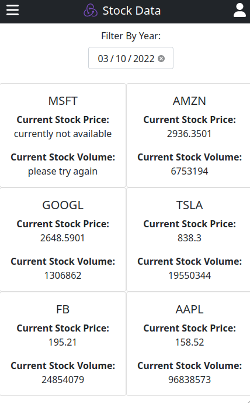

# Stock Data App


> Mobile Application that shows historical stock prices, and buy recommendation on specific stocks.



## Live Demo

[](https://sad-edison-40e613.netlify.app/)

## Table of Contents

- [Description](#description)
- [Built With](#built-with)
- [Getting Started](#getting-started)
  - [Setup](#setup)
- [Scripts](#scripts)
  - [Start dev server](#start-dev-server)
  - [Build for production](#Build-for-production)
  - [Contact Info](#contact-info)
- [Show Your Support](#how-your-support)
- [Acknowledgments](#acknowledgments)
- [License](#license)

## Description

Stock Data is the Capstone React-Redux individual project from the Microverse Curriculum.
Features:

- Display current stock prices.
- Filter the list based on date and preview prices back then.
- Display a summarized recommendation on "Should you buy that stock".

## Built With

- [Create React App](https://create-react-app.dev/) Set up a modern web app by running one command.
- [React Router](https://reactrouter.com/) A declarative library for building single page applications.
- [Redux](https://redux-toolkit.js.org/) The official, opinionated, batteries-included toolset for efficient Redux development.
- [Bootstrap](https://getbootstrap.com/) Build fast, responsive sites with Bootstrap.

## Getting Started

To get a local copy up and running follow these simple example steps.

### Prerequisites

- `node` : `^12 || >=14`
- `npm` or `yarn`

### Setup
 
1. Download or fork this project: ```git clone https://github.com/eduardosancho/stock-data.git```
2. cd into the directory. ```cd stock-data```
3. Install all dependencies using:

- `npm install` or `yarn`

## Scripts

### Start dev server

- `npm start` or `yarn start` and open the browser at `http://localhost:3000`

### Build for production

- `npm run build` or `yarn run build`

### Locally preview production build

After creating the production build, run:

- `npm run preview` or `yarn run preview` and open the browser at `http://localhost:5000`

## Contact Info

👤 **Eduardo**

 Platform | Badge |
 --- | --- |
 **GitHub**  | [@eduardosancho](https://github.com/eduardosancho)
 **Twitter** | [@sanchitobless](https://twitter.com/sanchitobless)
 **LinkedIn** | [Eduardo](https://www.linkedin.com/in/eduardo-sancho-solano/)

## Show your support

Give a ⭐️ if you like this project!

## Acknowledgments

The ideas and inspiration from this project are coming from the following articles:

- Microverse
- [Design guidelines](https://www.behance.net/gallery/31579789/Ballhead-App-(Free-PSDs)) from [@Nelson Sakwa](https://www.behance.net/sakwadesignstudio)


## License

This project is [MIT](./MIT.md) licensed.
